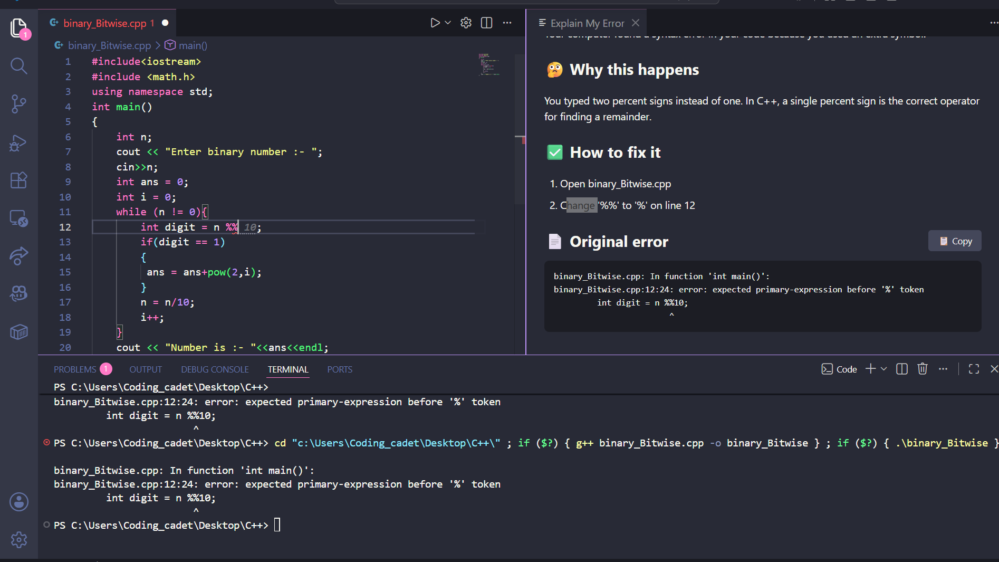
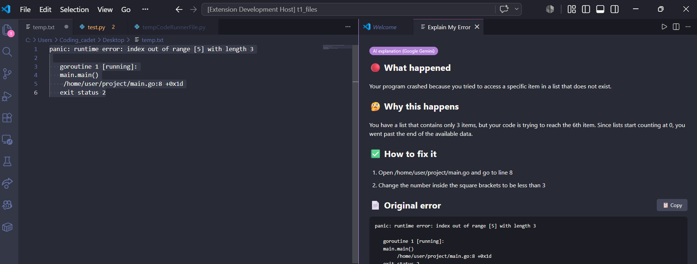

# Explain My Error

Turns cryptic terminal errors into plain-English explanations with concrete fix steps — right inside VS Code.

*Real project, real error, real fix — auto-detected the moment the build failed.*

*Even for errors outside the 99 built-in patterns, the AI fallback gives a precise, specific answer — not a generic guess.*

## Why

When you're running a project and something fails in the terminal, the error message is often technically correct but hard to actually *use* — too much jargon, no clear next step. This extension gives you:

- 🔴 **What happened** — one plain sentence
- 🤔 **Why it happens** — the actual root cause, explained simply
- ✅ **How to fix it** — concrete, runnable steps, not vague advice

## What's covered

The local rule database currently has **99 tested error patterns** across these categories (this table reflects the actual rule database — regenerate it anytime with `node scripts/generate-coverage.js` after adding new rules):

| Category | Rules |
|---|---|
| JavaScript / TypeScript / Node.js | 20 |
| Python | 11 |
| Java | 9 |
| General / OS / Networking | 9 |
| Git | 6 |
| C# / .NET | 5 |
| Go | 5 |
| Ruby | 5 |
| Databases (MongoDB, MySQL, PostgreSQL) | 4 |
| C / C++ | 4 |
| PHP | 4 |
| Swift | 4 |
| Docker | 3 |
| Test frameworks & linters (pytest, Jest, ESLint) | 3 |
| Build tools (Maven, Gradle, CMake) | 3 |
| Kotlin | 3 |
| Rust | 1 |

**Note on verification:** rules for Node/JS, Python, Git, and Go were tested against real, live error output. Rules for Java, C#, Kotlin, Ruby, PHP, Swift, and Rust are based on well-documented, stable standard error formats for those languages, but haven't all been run against a live compiler/runtime in this project's testing — if you spot one that's wrong or could be more precise, contributions/corrections are welcome.

Anything not covered above still gets a reasonable explanation via the optional AI fallback (see below) — confirmed working in practice on completely uncovered languages (Kotlin and Go were tested via AI fallback before rules were added for them, and both gave correct, language-specific explanations).

## Features

- **Instant local matching** for 55+ of the most common Node/npm, Python, git, Docker, database, and general OS errors — no internet or API key required.
- **Optional AI fallback** for anything not in the local database (off by default — you opt in and choose your own provider).
  - Supports **Google Gemini** (has a free tier — good default if you don't want to pay), **Anthropic Claude**, or **OpenAI**.
  - Bring your own API key for whichever provider you pick; switch anytime with **"Explain My Error: Configure AI Provider"**.
- **Auto-detect**: get a gentle prompt when a terminal command exits with an error (requires shell integration support — see below).
- **Manual mode**: select any error text in an editor or terminal and run "Explain Selected Text" from the command palette.

## Usage

1. Run a command in the integrated terminal.
2. If it fails, you'll see a prompt: **"Explain My Error: this command exited with an error."** Click **Explain it**.
3. Or run **Explain My Error: Explain Last Terminal Error** from the Command Palette (`Cmd/Ctrl+Shift+P`) at any time.
4. Or select error text anywhere and run **Explain My Error: Explain Selected Text**.

## All commands

Access these anytime via the Command Palette (`Cmd/Ctrl+Shift+P`):

| Command | What it does |
|---|---|
| **Explain My Error: Explain Last Terminal Error** | Explains the most recently detected failing command |
| **Explain My Error: Explain Selected Text** | Explains whatever error text you've selected in the editor |
| **Explain My Error: Configure AI Provider** | Choose an AI provider (Gemini, Hugging Face, Anthropic, OpenAI) and enter its API key |
| **Explain My Error: Toggle Auto-Detect On Failure** | Turn the automatic "command failed" popup on or off |
| **Explain My Error: Clear Cached AI Responses** | Wipe locally cached AI answers, so the next matching error gets a fresh AI response |

## Settings

| Setting | Default | Description |
|---|---|---|
| `explainMyError.autoDetect` | `true` | Show a prompt automatically when a terminal command fails. |
| `explainMyError.useAiFallback` | `false` | Send unmatched errors to an AI model for an explanation. Requires your own API key. Nothing is sent anywhere unless this is turned on. |
| `explainMyError.maxOutputLines` | `40` | How many recent terminal lines to scan for an error. |

## Privacy

- With `useAiFallback` off (the default), **nothing ever leaves your machine**. All matching happens locally against the bundled rule database.
- If you turn AI fallback on, only the captured error text (and optionally a code snippet) is sent to the AI provider, using your own API key stored securely via VS Code's Secret Storage — never written to plain settings files.

## A note on free tiers

The AI fallback is optional and only used when a local rule doesn't match. If you enable it, here's what to expect from each provider's free option:

- **Hugging Face** — generally the most reliable free option to get working. You'll need to enable at least one inference provider on your account first (https://huggingface.co/settings/inference-providers), and the exact model you use needs to be supported by whichever provider you enable (configurable via `explainMyError.huggingfaceModel`). Includes a small free monthly inference allowance (around $0.10, resets monthly) — enough for roughly 100-500+ error explanations depending on which model you choose (smaller models cost less per request). Check your remaining balance anytime at huggingface.co/settings/billing.
- **Google Gemini** — has a genuinely generous free tier on paper, but some accounts see `429 RESOURCE_EXHAUSTED` errors with `limit: 0` even on a brand new project's very first request. This isn't a bug in the extension — it appears to be an account-level eligibility gate on Google's side (possibly tied to phone verification or account trust signals), and isn't limited to any particular country. If you hit this, there's no fix on the extension's end; try Hugging Face instead.
- **OpenAI** — reliable, but paid from the start (only a small trial credit for brand-new accounts, no ongoing free tier).

If any provider gives you trouble, switch anytime with **"Explain My Error: Configure AI Provider."**

## Requirements

- VS Code 1.93 or newer (for terminal shell integration / auto-detect). The extension still works without it via manual "Explain Selected Text".

## Known limitations

- Auto-detect depends on your shell supporting VS Code's shell integration (bash, zsh, PowerShell, fish are supported; some custom shell configs may not report exit codes).
- The local rule database currently covers common Node/npm, Python, and git errors — more categories are planned.

## Contributing

Found an error that should be in the local database? Open an issue or PR with the error text and a suggested plain-English explanation.

## License

MIT
